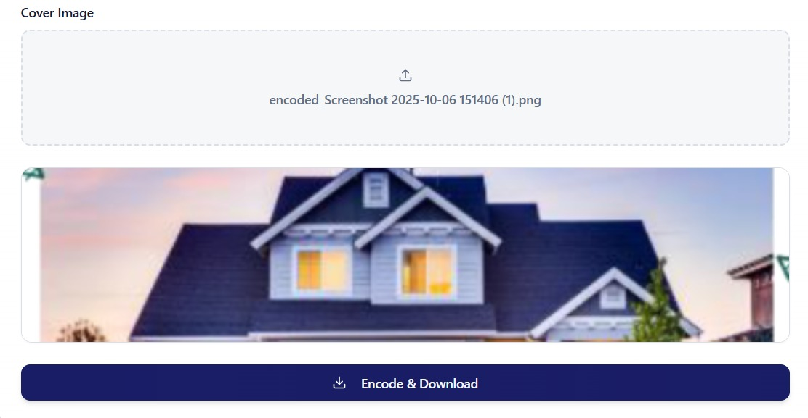
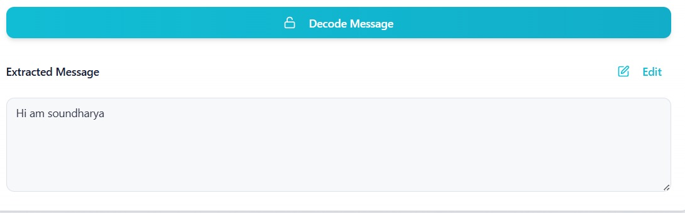
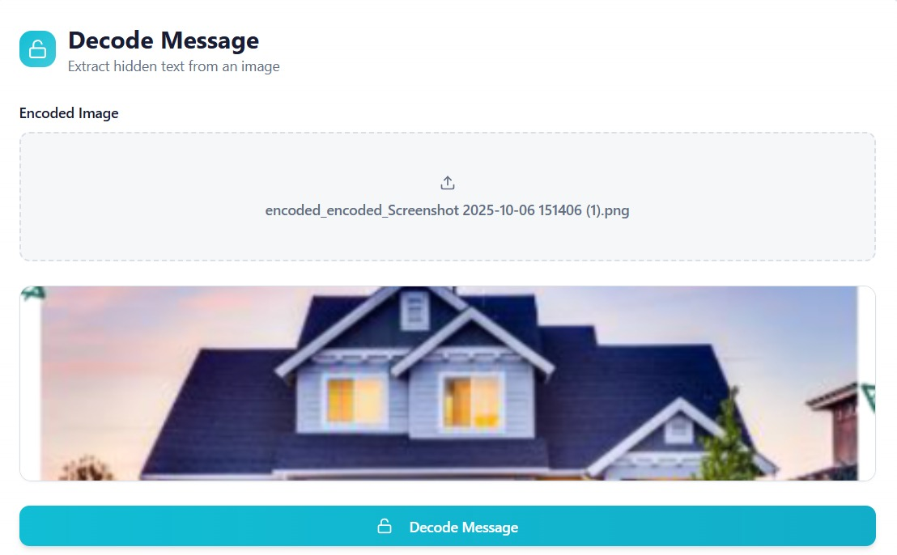

# Digital Steganography - Whisper Image Secret

A modern web application for hiding secret messages within images using steganography techniques. Encode and decode hidden text seamlessly with an intuitive user interface.

## Features

- **Encode Messages**: Hide secret text within any image
- **Decode Messages**: Extract hidden messages from encoded images
- **User-Friendly Interface**: Clean and intuitive design built with modern web technologies
- **Secure**: Messages are embedded directly into image pixels
- **Real-time Processing**: Fast encoding and decoding operations

## Screenshots

### Encode Message
Hide your secret message within an image:



### Decode Message
Extract hidden messages from encoded images:



### Example Result
Successfully extracted message from an encoded image:



## How It Works

### Encode a Message
1. Enter your secret message in the text field
2. Upload a cover image (PNG format recommended)
3. Click "Encode & Download"
4. Download the encoded image with your hidden message

### Decode a Message
1. Upload an image that contains a hidden message
2. Click "Decode Message"
3. The secret message will be extracted and displayed

## Project Info

**Repository**: https://github.com/Soundharyaraja147/Digital-steganography.git

## Getting Started

### Prerequisites

- Node.js & npm installed - [install with nvm](https://github.com/nvm-sh/nvm#installing-and-updating)

### Installation

```sh
# Step 1: Clone the repository
git clone https://github.com/Soundharyaraja147/Digital-steganography.git

# Step 2: Navigate to the project directory
cd Digital-steganography

# Step 3: Install dependencies
npm install

# Step 4: Start the development server
npm run dev
```

## Technologies Used

This project is built with:

- **Vite** - Fast build tool and development server
- **TypeScript** - Type-safe JavaScript
- **React** - UI library
- **shadcn-ui** - Beautiful UI components
- **Tailwind CSS** - Utility-first CSS framework
- **Steganography Algorithm** - LSB (Least Significant Bit) technique for hiding data

## How to Use

## How to Use

1. **Launch the application**
   ```sh
   npm run dev
   ```
   
2. **Choose an operation**:
   - Navigate to the Encoder to hide a message
   - Navigate to the Decoder to reveal a hidden message

3. **Encode a secret message**:
   - Type your secret message
   - Upload a cover image
   - Click "Encode & Download"
   - Save the encoded image

4. **Decode a hidden message**:
   - Upload an encoded image
   - Click "Decode Message"
   - View the extracted secret message

## Project Structure

```
├── src/
│   ├── components/
│   │   ├── Encoder.tsx       # Message encoding component
│   │   ├── Decoder.tsx       # Message decoding component
│   │   └── ui/               # UI components (shadcn-ui)
│   ├── utils/
│   │   └── steganography.ts  # Core steganography algorithms
│   ├── pages/
│   │   ├── Index.tsx         # Main page
│   │   └── NotFound.tsx      # 404 page
│   └── App.tsx               # Main app component
├── public/                    # Static assets
└── package.json              # Dependencies and scripts
```

## Contributing

Contributions are welcome! Feel free to submit issues and pull requests.

## License

This project is open source and available for educational purposes.

## Deployment

This project can be deployed on various platforms:

- **Vercel**: Connect your GitHub repository for automatic deployments
- **Netlify**: Deploy with continuous integration from GitHub  
- **GitHub Pages**: Host directly from your repository

## Contact

For questions or feedback, please open an issue on GitHub.

---

Built with ❤️ using React and modern web technologies
